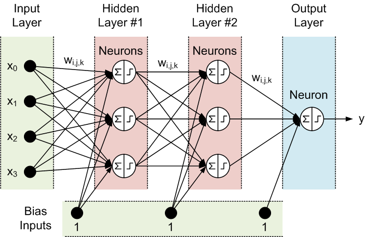

## NeuralNetwork-From-Scratch

### Problem Statement

To build a complete neural network for Digit Recognition for MNIST dataset using Numpy. 

The MNIST dataset is being used to train model to classify handwritten digits between 0-9.

The steps involved are:

1. Data preparation
2. Feedforward
3. Loss computation
4. Backpropagation
5. Parameter updates
6. Model training and predictions

